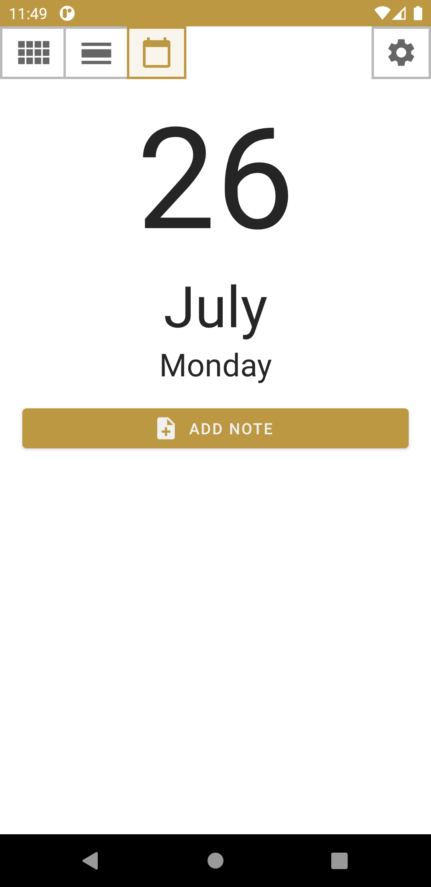
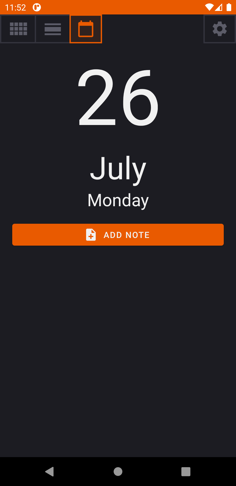
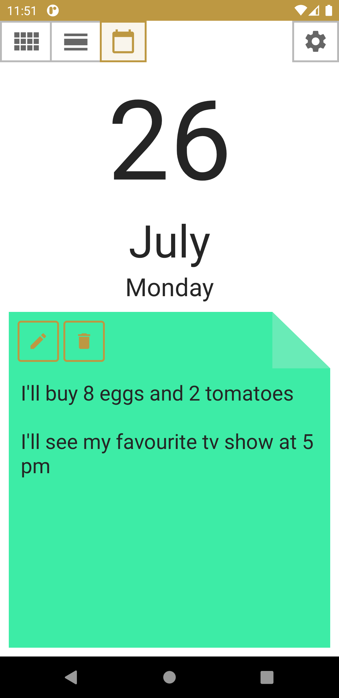
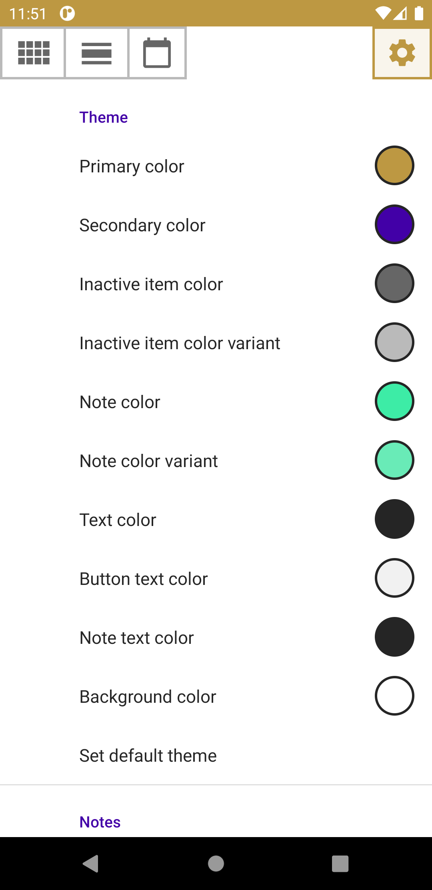
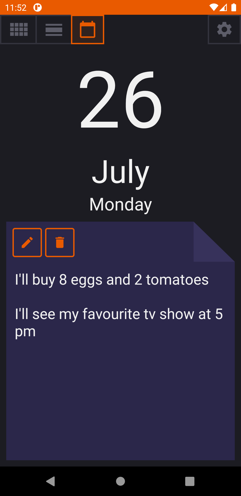
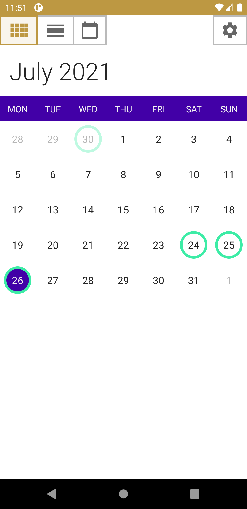
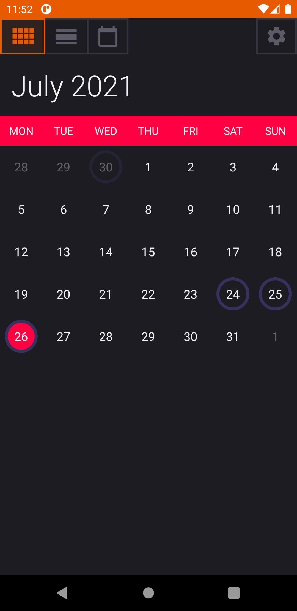
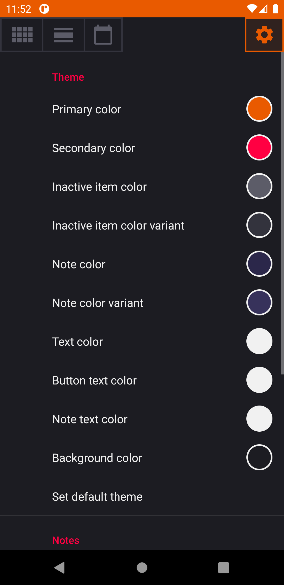
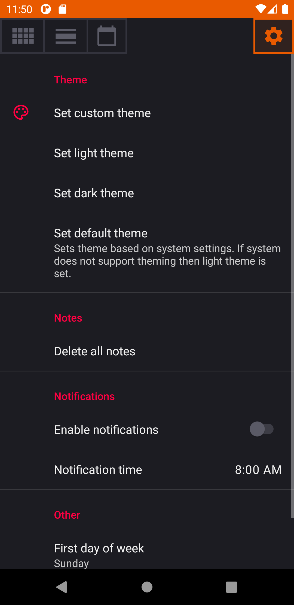

# NoteCalendar

*Note Calendar* is a simple offline app which allows to manage notes for different days and offers a
quick way to reach each of them.

Minimum Android version: 5.0 (Lollipop, API level 21)

[Google Play](https://play.google.com/store/apps/details?id=com.sztorm.notecalendar)

## Screenshots

 

 

 

 

 

## Possibilities

Day tab allows to add, edit or delete note.

Week tab holds a days list to quickly move to other day of the week.

You can easily see which days contain note via month tab. If a day number is surrounded by ring then
it contains note.

Application offers notifications which can be enabled to remind about a note created for next day at
given time. For example you can set notification time to time before your alarm clock time in order
to wake up and read note with something important to do.

Application settings include:

 * Theming
    * Setting custom theme which includes 10 modifiable colors
    * Setting light theme
    * Setting dark theme
    * Setting default theme based on system settings
 * Notes deletion
 * Notifications management
    * Enabling or disabling
    * Setting notification time
 * Setting first day of week
 
## License

*NoteCalendar* is licensed under the MIT license.

[More about license](LICENSE)

[Privacy Policy](PRIVACY-POLICY.md)