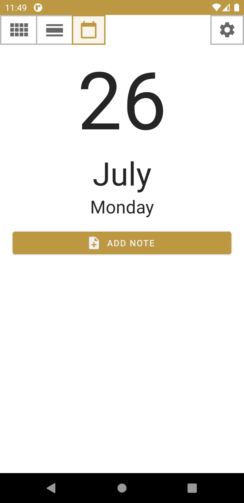
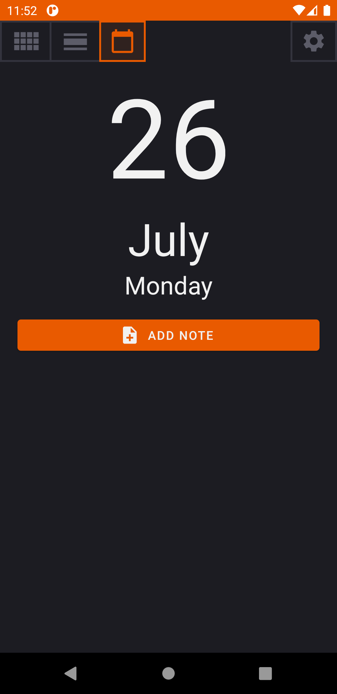
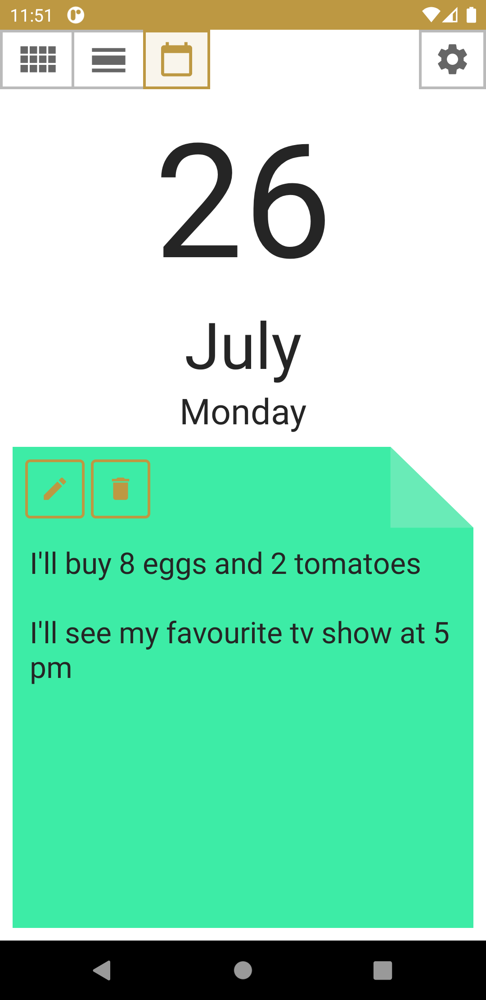
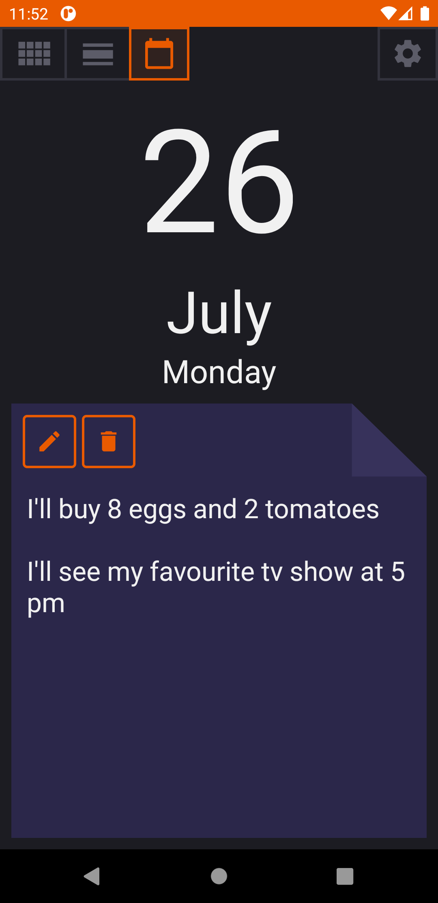
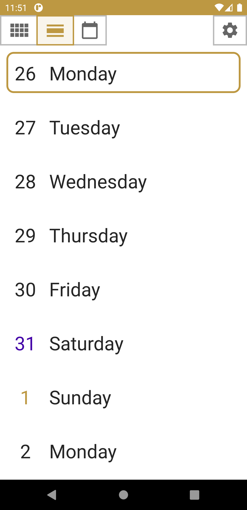
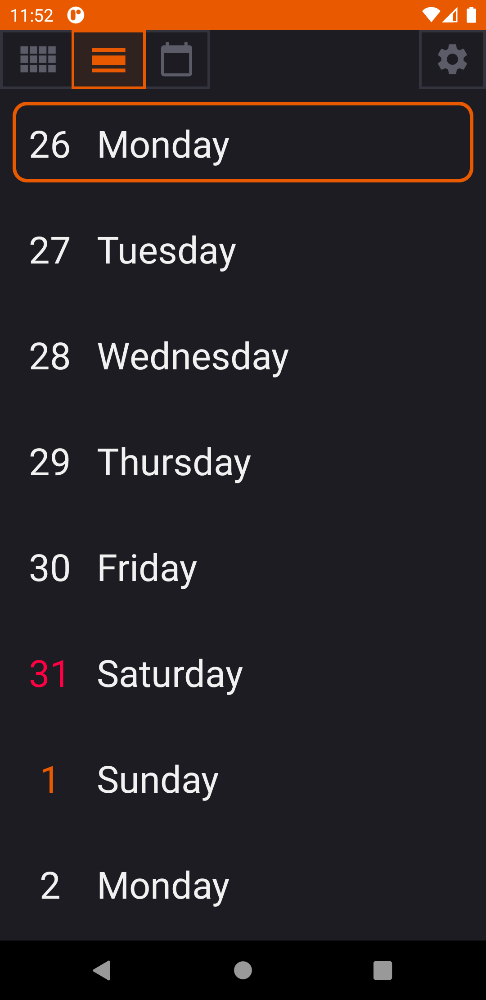
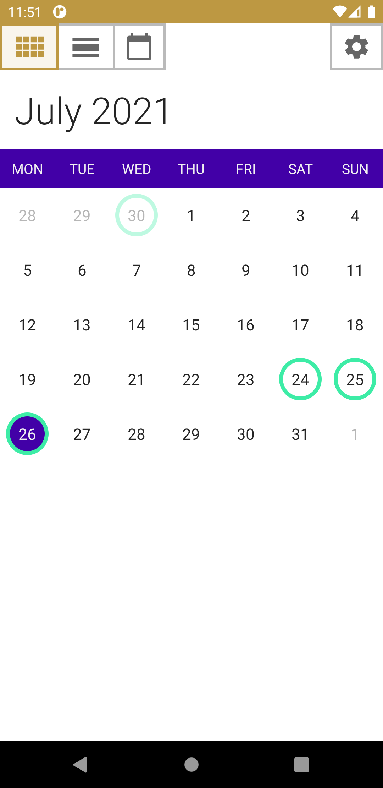
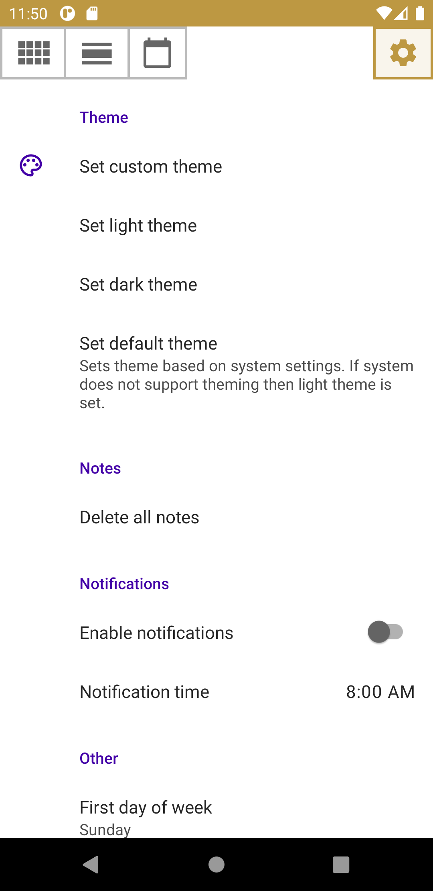
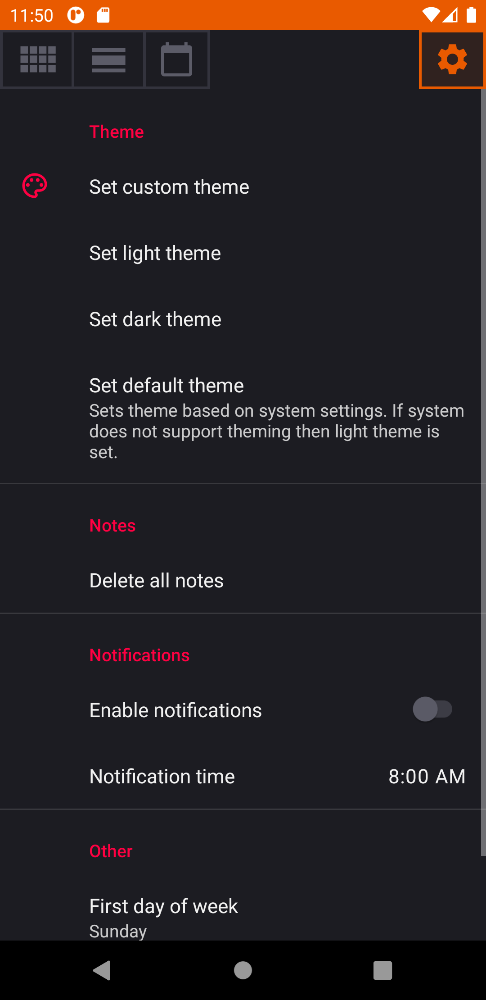

# NoteCalendar

*Note Calendar* is a simple offline app which allows to manage notes for different days and offers a
quick way to reach each of them.

Minimum Android version: 5.0 (Lollipop, API level 21)

## Screenshots

   

   

 

## Features

* Day view
  * This view is used to add, edit or delete note
* Week view
* Month view
  * Days that constains a note are marked with a ring
  * Day that is currently selected is marked with a solid circle
  * Today's day is marked with a different color of text
  * Long press on a day's number allow to quickly add or edit note for that day
* Settings view
  * Theming
    * Setting custom theme which includes 10 modifiable colors
    * Setting light theme
    * Setting dark theme
    * Setting default theme based on system settings
  * Notes deletion
  * Notifications
    * When turned on, a notification will appear at notification time
  * Setting first day of week
  * Setting starting view

## Translations

You can help with translations on https://hosted.weblate.org/projects/note-calendar/.

Accessible translation platform is available thanks to Weblate and their support for libre projects. Hosting such platform costs money, if you want to help the Weblate project, you can donate [here](https://weblate.org/pl/donate/).

## License

*NoteCalendar* is licensed under the MIT license.

[More about license](LICENSE)

[Privacy Policy](PRIVACY-POLICY.md)